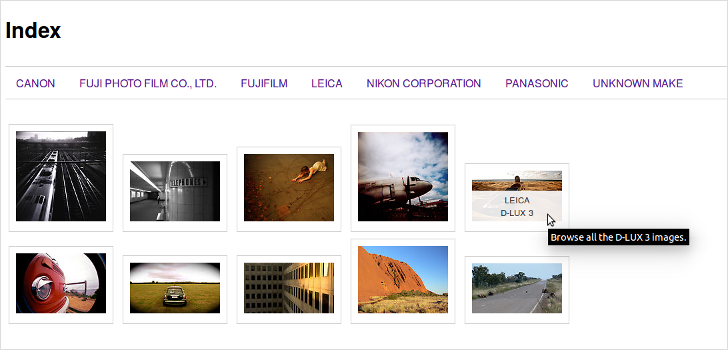

Images Gallery Generator Kata
=============================

[](https://travis-ci.org/gonzalo-bulnes/kata-images_gallery_generator)
[](https://codeclimate.com/github/gonzalo-bulnes/kata-images_gallery_generator)
[](http://inch-ci.org/github/gonzalo-bulnes/kata-images_gallery_generator)

Generate a set of static HTML files from an XML representation of EXIF data so users can browse large collections of images.



Installation
------------

Add the gem to your `Gemfile`:

```ruby
# Gemfile

gem 'images_gallery', '~> 1.0' # see semver.org
```

Usage
-----

```bash
# Generate a gallery inside spec/tmp from the example source file
images_gallery generate spec/fixtures/works.xml spec/tmp

# Read usage intructions:
images_gallery help

# Open the images gallery automatically after it was generated
firefox $(images_gallery generate spec/fixtures/works.xml spec/tmp/)
```

Development
-----------

### Test suite

```bash
# Run the test suite
rake

# Run the acceptance test suite only (can be seen as a demo)
rake features
# Visit spec/tmp/index.html to browse the sample images
```

### Parser

The `ImageGallery::Source` relies on the **LibXML** SAX parser to extract the images described in the source XML file (e.g. [`works.xml`][example-source]). That parser is [known to be fast][libxml-benchmarks] and [memory-thrifty][sax-versus-dom].

  [example-source]: spec/fixtures/works.xml
  [libxml-benchmarks]: https://github.com/xml4r/libxml-ruby#performance
  [sax-versus-dom]: http://www.saxproject.org/event.html

About
-----

This kata aims at writing a command-line tool to process **large** XML files which contain images metadata. Part of that metadata is relevant, and the images gallery should allow to preview a collection of thumbnails classified by camera **make**, **model** and **ISO speed ratings**.

Because the images collections can be really large, [care has been taken][parser] to avoid loading the XML document in memory while parsing it.

  [parser]: https://github.com/gonzalo-bulnes/kata-images_gallery_generator/tree/add-acceptance-test-suite#parser

Yet huges collections to review do also mean you probably don't want to review them without involving your team. That's to say the images gallery deployment is a key aspect of the task at hand, and keeping the files tree as simple as possible is a way to make the deployments as straightforward as possible. No external CSS, nor font, nor javascipts then.

The views/templates pattern makes the design extensible, this galleries generator is no <abbr title="Content Management System">CMS</abbr> however! Priority has been given to simplify as much as possible the rendering engine task. Plain ERb should keep the HTML generation fast, while a basic partials system ensures that adding a few front-end features remains [a _pomodoro_-sized task][pomodoro]. (If more features would to be added, however, the views mechanics and the templates management should be refined - see the naviagtion links generation for example.)

  [pomodoro]: https://github.com/gonzalo-bulnes/kata-images_gallery_generator/commit/a90590e63f65d0b166c93e709a17a267c9ec119f

The main user interface is the CLI, which was built with [Thor][thor] as a way to make it both user-friendly and extensible. The CLI output was kept minimal, to make easy to insert the **images_gallery** program into any processing pipeline (since we are talking about large amount of data here, then we're probably also talking about processing pipelines).

That's pretty much all... a last word about those [particularly numerous shared specs][shared]. I like to define the "public" API of the main classes this way in order to ensure I keep always at sight which methods I can depend on and which others could lead to tighter undesired coupling. These interfaces are kinds of [consumer-driven contracts][cdc] and keeping them apart helps to remember that.

  [thor]: http://whatisthor.com
  [shared]: https://github.com/gonzalo-bulnes/kata-images_gallery_generator/tree/add-acceptance-test-suite/spec/support
  [cdc]: http://martinfowler.com/articles/consumerDrivenContracts.html

License
-------

    Images Gallery Generator
    Copyright (C) 2015 Gonzalo Bulnes Guilpain

    This program is free software: you can redistribute it and/or modify
    it under the terms of the GNU General Public License as published by
    the Free Software Foundation, either version 3 of the License, or
    (at your option) any later version.

    This program is distributed in the hope that it will be useful,
    but WITHOUT ANY WARRANTY; without even the implied warranty of
    MERCHANTABILITY or FITNESS FOR A PARTICULAR PURPOSE.  See the
    GNU General Public License for more details.

    You should have received a copy of the GNU General Public License
    along with this program.  If not, see <http://www.gnu.org/licenses/>.
